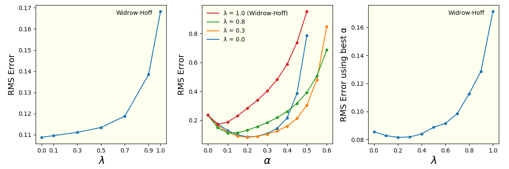

# Replicating Sutton's TD(&lambda;) Algorithm
This code solves 1st project of CS-7642-O03 Reinforcement Learning and Decision Making, part of OMSCS program, generating the charts used in the report:


## Usage
Running it is pretty straightforward. Just do:
```bash
python final_solution.py
```
and the program will simulate the experiments described in the [paper](paper.pdf) and generate 4 PNG pictures in `images` folder: 3 replications of Richard Sutton's 1988 *Learning to Predict by the Methods of Temporal Differences*  Figures **3, 4, and 5**, and one image combining them all.

The code also creates a video animation used in the report, which can be seen in [this Youtube link](https://youtu.be/mBqyQpL8_Vc). To re-create it, you will have to run 2 commands in parallel: i) one to capture the live data being produced by the simulation (and either display it in the screen or save it in `images/animation.mp4`), and ii) other to generate the live data. To do (i), first run:
```bash
python live_plot.py
```
Then, to generate the live data (ii), then run in parallel:
```bash
python final_solution.py --live
```
The default behaviour of `live_plot.py` program is to save the video in the file `images/animation.mp4`. If instead you want to see it in the screen, run `python live_plot --show` instead.

## Installation
After cloning the code into your local environment, run:
```bash
pip install -r requirements.txt
```
to install all dependencies needed to run this program.

## Author
This program was created by [Carlos Souza](mailto:souza@gatech.edu), as 1st project of CS-7642-O03 Reinforcement Learning and Decision Making, part of OMSCS program.