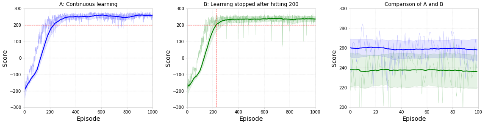

# Lunar Lander with Deep Reinforcement Learning
This code solves 2nd project of CS-7642-O03 Reinforcement Learning and Decision Making, part of OMSCS program, generating the charts used in the report:


## Usage
Running it is pretty straightforward. Just do:
```bash
python3 main_pytorch.py
```
and the program will simulate the integrated agent described in the paper for a single run, learning for 500 episodes, then testing the trained agent for 100 episodes. This should take ~20min.

The charts used in the report are created by running the experiments in the `experiments` folder. In each of its subfolders, there is a `protocol.json` file containing the details of that specific experiment. To run these experiments, you should either run:
```bash
python3 parallel_runs.py folder_name
```
or
```bash
python3 parallel_experiments.py folder_name
```
where `folder_name` is the name of the experiment (e.g. `e1`, `e2`, `e_test`, etc). The first command executes multiple runs for each experiment, being this number set in global parameters in the json file. The second command executes a single run for each experiment in a protocol, but multiple experiments in parallel.
These experiments take several days to generate the data. Once completed, the notebook `paper_figures.ipynb` is used to generate the paper figures.

## Installation
After cloning the code into your local environment, run:
```bash
sudo apt install python3-pip python python-setuptools python-dev python-augeas gcc swig dialog
pip3 install numpy scipy matplotlib ipython jupyter pandas sympy nose gym torch torchvision
```
To [install PyBox2D](http://www.kiranjose.in/blogs/getting-started-with-openai-gym-part-1-installation-and-configuration/), run:
```bash
git clone https://github.com/pybox2d/pybox2d
cd pybox2d/
python3 setup.py clean
python3 setup.py build
sudo python3 setup.py install
```

## Author
This program was created by [Carlos Souza](mailto:souza@gatech.edu), as 2nd project of CS-7642-O03 Reinforcement Learning and Decision Making, part of OMSCS program.
