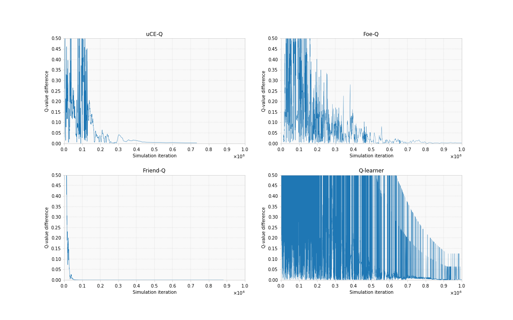

# Replicating Greenwald and Hall's Correlated-Q Learning in Soccer
This code solves 3rd project of CS-7642-O03 Reinforcement Learning and Decision Making, part of OMSCS program, generating the charts used in the report:


## Usage
Running it is pretty straightforward. Just do:
```bash
python3 agents.py {qlearner, friendq, foeq, or uceq}
```
This will train each of the agents, generating the CSV data used to create the figure with all 4 charts in the file 'images/figure2.png', used in the
report. These experiments take several days to generate the data. Once completed, the notebook `charts.ipynb` is used to generate the paper figures.

## Installation
After cloning the code into your local environment, run:
```bash
pip3 install numpy scipy matplotlib ipython jupyter pandas sympy nose pulp
```

## Author
This program was created by [Carlos Souza](mailto:souza@gatech.edu), as 3rd project of CS-7642-O03 Reinforcement Learning and Decision Making, part of OMSCS program.
